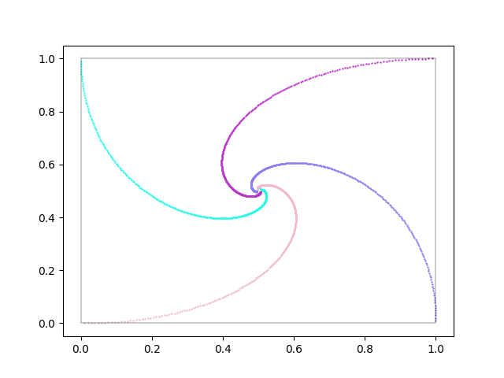
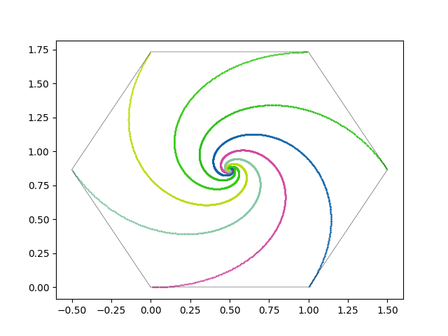
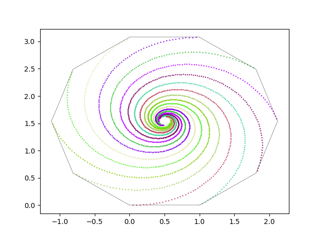

# visualize-bugs-on-square

Visualization script for the problem of _bugs on square_, but it can also be used for other polygons.

Number of bugs (or corners of the polygon) is determined by the `size` variable. The polygon always has a corner on (0, 0), is right-aligned and equilateral. The bugs start from the corners of the polygon.

## Visualizations

A square:  

A hexagon:  

A decagon (speed of bugs increased to get a faster result):  

